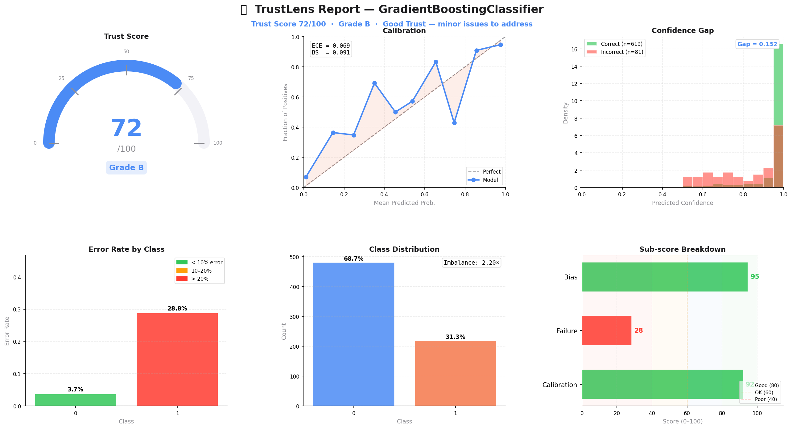

<div align="center">
  

<br/>

### Your model has 92% accuracy. **That's not enough.**

**The open-source Python library that answers the questions accuracy never does.**
Calibration · Failure Analysis · Bias Detection · Explainability — in one function call.

<br/>

[](https://pypi.org/project/trustlens/)
[](https://github.com/Khanz9664/TrustLens/actions)
[](LICENSE)
[](https://github.com/Khanz9664/TrustLens/stargazers)
[](https://pypi.org/project/trustlens)

<br/>

⭐ **Star the repo to support the project!**

🛠 **Actively looking for contributors - beginner-friendly issues available**

<br/>

[**Get Started**](#quickstart) · [**Live Demo**](examples/trustlens_demo.ipynb) · [**PyPI**](https://pypi.org/project/trustlens) · [**Discussions**](https://github.com/Khanz9664/TrustLens/discussions)

</div>

---

## The Problem Nobody Ships Around

You trained a model. It hits **92% accuracy** on your validation set. You ship it.

Three months later:

- A minority-class user gets consistently wrong predictions.
- The model is **90% confident on its worst mistakes**.
- A regulator asks *"why did it make that decision?"* — and you have no answer.

Sound familiar? You're not alone.

**Accuracy tells you how often your model is right.**
**It tells you nothing about *when* it fails, *why* it fails, or *who* it fails.**

TrustLens makes those failures visible — before they reach production.

---

### 🎯 Who This Is For

- **ML Engineers** building mission-critical production systems.
- **Data Scientists** who need to justify model decisions to stakeholders.
- **Researchers** benchmarking the reliability of new architectures.
- **AI Teams** focused on safety, fairness, and regulatory compliance.

---

## One-Line Magic
👉 **Full reliability analysis in one line.**

```python
from trustlens import quick_analyze

# Loads dataset, trains a baseline, and runs the full analysis.
quick_analyze(dataset="breast_cancer").show()
```

No setup. No boilerplate. Just insight.
Output includes Trust Score, calibration curves, bias metrics, and failure analysis.

---

## 🚀 Quickstart

### 1. Install
```bash
pip install trustlens
```

### 2. Analyze Your Model
```python
from trustlens import analyze

report = analyze(
    model,          # any sklearn-compatible model (including XGBoost and LightGBM)
    X_val,          # validation features
    y_val,          # ground truth labels
    y_prob=proba,   # predicted probabilities
)

print(report.trust_score)
report.show()
```

### 3. Save & Log
```python
# Export to JSON (perfect for CI/CD pipelines and tracking)
report.save("report.json")

# Export to human-readable TXT for sharing
report.save("report.txt")
```

---

## Example Dashboard
Everything your team needs to see, in one presentation-ready view.



```python
report.summary_plot()
```

This is what "model trust" actually looks like.

---

## Features & Output
TrustLens goes beyond pass/fail — it explains why your model should or shouldn't be trusted. It provides a deep dive into the four dimensions of model trust.

### The Trust Score
A single, actionable number: **0 to 100.** Computed from four independently interpretable dimensions:

| Dimension | What it measures | Weight |
|---|---|---|
| **Calibration** | Do probabilities reflect reality? | 35% |
| **Failure** | Does confidence correlate with accuracy? | 30% |
| **Bias** | Are all groups treated equally? | 25% |
| **Representation** | Is the embedding space well-structured? | 10% |

Weights are empirically chosen and will be configurable in future releases.

### Find Your Most Dangerous Mistakes
```python
report.show_failures(top_k=5)
```
Surfaces high-confidence misclassifications — the "silent killers" of production ML. TrustLens identifies where the model is certain it's right, but is actually wrong.

---

## Real-World Use Cases

**Medical AI**
Identify overconfidence in edge cases before a diagnostic model reaches a patient. TrustLens flags high ECE (>0.15) early.

**Fraud Detection**
Quantify your false-negative problem. If your confidence gap is low, your model is equally confident on the fraud it catches and the fraud it misses.

**Hiring & Lending**
Automated subgroup analysis reveals performance gaps across demographics before they become regulatory liabilities.

**Enterprise MLOps**
Connect to MLflow or W&B to track Trust Score decay across training runs and automated deployments.

---

## 🏗 Architecture

TrustLens is built as a modular, extensible framework:

```
trustlens/
├── metrics/           # Brier, ECE, Confidence Gap, Subgroup Bias
├── explainability/    # Faithfulness, Grad-CAM, Eigen-CAM
├── visualization/     # Dashboarding, Reliability Curves, Embedding Plots
├── api.py             # zero-friction entry points
├── report.py          # Serialisation and human-readable exports
└── trust_score.py     # Weighted trust consensus
```

---

## 🌟 Contributors

<table>
  <tr>
    <td align="center">
      <a href="https://github.com/Khanz9664">
        
        <br />
        <sub><b>Khanz9664</b></sub>
      </a>
    </td>
    <td align="center">
      <a href="https://github.com/jayssSmm">
        
        <br />
        <sub><b>jayssSmm</b></sub>
      </a>
    </td>
    <td align="center">
      <a href="https://github.com/WeiGuang-2099">
        
        <br />
        <sub><b>WeiGuang-2099</b></sub>
      </a>
    </td>
    <td align="center">
      <a href="https://github.com/CrepuscularIRIS">
        
        <br />
        <sub><b>CrepuscularIRIS</b></sub>
      </a>
    </td>
  </tr>
</table>

Want to see your name here? Check out `good first issue` 👇

---

## 🛠 Contributing

TrustLens is a production-grade tool, and our community is already exploring and contributing new features. We welcome developers of all levels!

### 🟢 Beginner
- Issues #1, #7, #13: Implementing core metrics.
- Issues #4, #5: Testing and documentation improvements.

### 🟡 Intermediate
- Issue #19: HTML Report generation.
- Issue #35: Weights & Biases (W&B) integration.
- Issue #51: `trustlens analyze` CLI support.

**Comment on an issue and I will guide you!** I am committed to making this a welcoming home for first-time open-source contributors. 🚀

[**Read the full Contributing Guide →**](CONTRIBUTING.md)

---

## 🛣 Roadmap Teaser
We are actively building features that make TrustLens the standard for model reliability:
-  **CLI Support**: `trustlens analyze --dataset iris`
-  **Integration**: First-class support for **MLflow** and **W&B**.
-  **Fairness**: Implementation of Equalized Odds and Demographic Parity.

Check the [**Full Roadmap**](ROADMAP.md) for more details.

---

## Citation

If you use TrustLens in research or production, please cite it:

```bibtex
@software{trustlens2026,
  author = {Shahid Ul Islam},
  title  = {TrustLens: Debug your ML models beyond accuracy},
  year   = {2026},
  url    = {https://github.com/Khanz9664/TrustLens},
}
```

---

## Author
**Shahid Ul Islam** — ML Engineer & Creator of TrustLens
[GitHub](https://github.com/Khanz9664) · [Portfolio](https://khanz9664.github.io/portfolio/) · [LinkedIn](https://www.linkedin.com/in/shahid-ul-islam-13650998/)

---

<p align="center">
  <strong>If TrustLens helped you understand your model better, give it a ⭐ — it helps others discover it.</strong><br><br>
  <a href="https://pypi.org/project/trustlens">PyPI</a> ·
  <a href="https://github.com/Khanz9664/TrustLens">GitHub</a> ·
  <a href="https://github.com/Khanz9664/TrustLens/discussions">Discussions</a>
</p>
